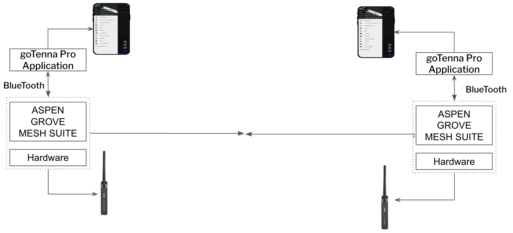
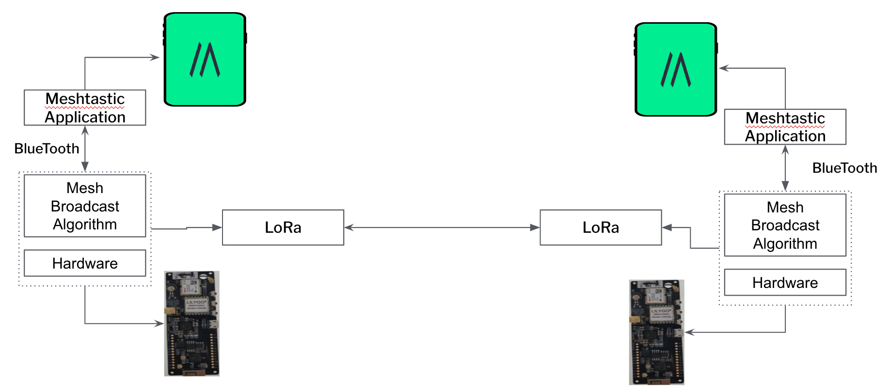
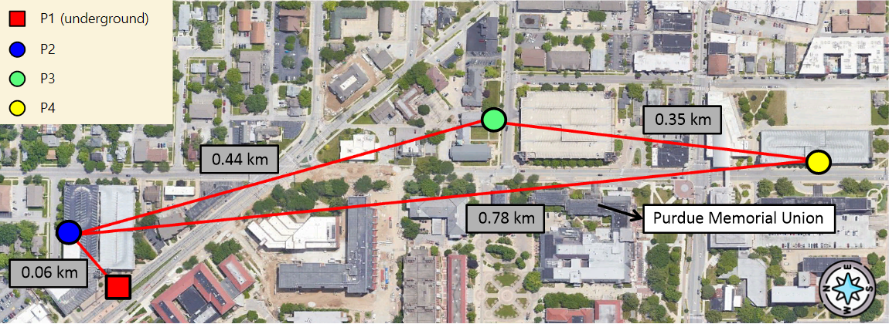
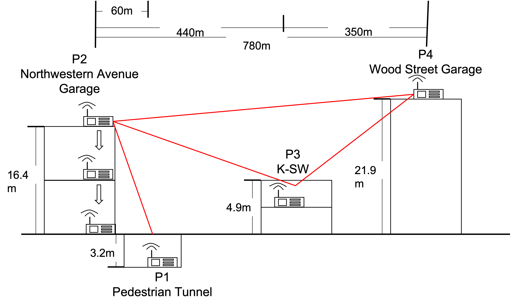
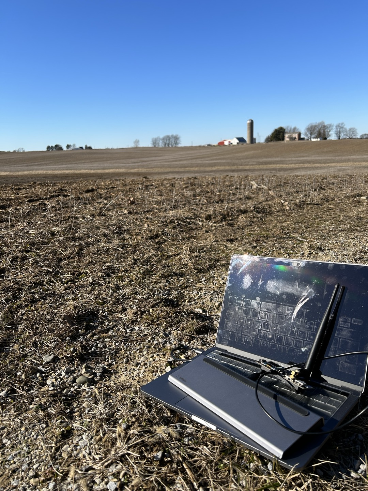
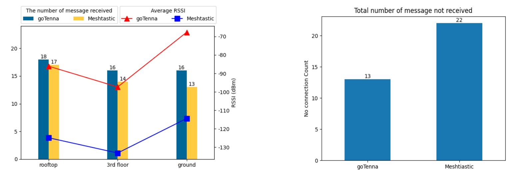
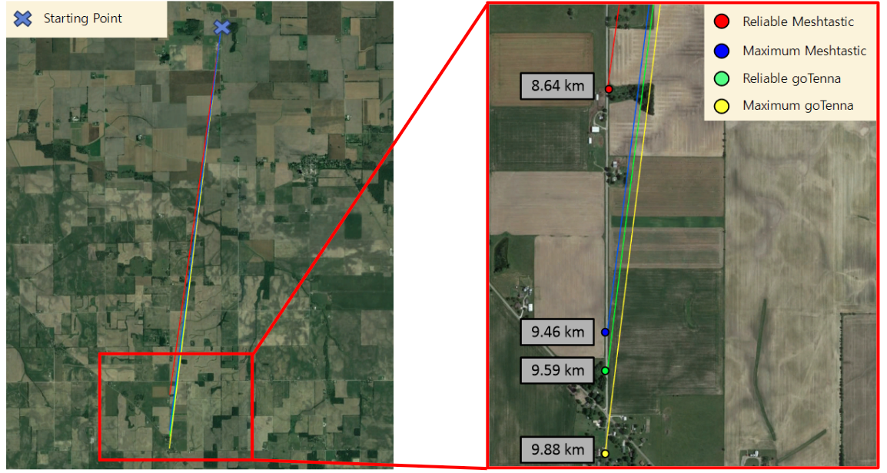

<h2>Team Member :smiley:</h2> 

### Gwangyeok Kim 🐝
- **Chonnam National University**
- Major in computer engineering
- Did some arduino project
- Handling C, C++, Java, linux
- **AI**, Natural language, computer vision, machine learning
- Interested in **semiconductor**

### Keonwoo Lim 🧸
- **Kyeonggi University**
- Major in computer engineering
- **Web development - Java(spring) Backend**
- A bit of frontend
- Android Java App development

### Sujee Noh 🐣
- **Chonnam National University**
- Major in software engineering
- Web development Backend using Django
- **IoT forensics research for one year**
- In software system and language lab (smart contract and blockchain technology)
- Handling Python, Javascript, linux, C++

### Younguk Maeng 🦦
- **Soongsil University**
- Major in software engineering
- Web development Backend using Spring
- **Intern as a backend developer for half a year**
- Handling Java, Spring, Python, Linux

<h2> Project Title </h2>

**Performance Evaluation of Off-grid Mesh Network
Communication using goTenna Pro X and Meshtastic**

<h2> Research Problem Statement </h2>

There has been a steady development in mesh networking in the past decade. This technology enables mobile, long-range connectivity even without cell, wifi or satellite connectivity. goTenna is arguably the world's leading mobile mesh networking company, providing off-grid connectivity solutions for smartphones and other devices, as well as augmenting traditional communications networks. The technology could be of use to firefighters, military operations, local law enforcement, search and rescue.

An alternative approach is the open source project called 'Meshtastic' to be an easy to use mobile ad-hoc mesh network that can be accessed by people without the need to have specific hardware or pre-downloaded software (such as a mobile app). The network is made up of multiple nodes such as smartphone and Web CLI. They can be set up with cost-effective components such as ESP32 boards, antenna and GPS modules.

There is a huge disparity in price between the two approaches, however they share the common goal: Establishing means of communication in a challenging environment without cell or WiFi access.

What we would like to do, therefore, is to explore the core technology of the two approaches then evaluate their performance in an indepth manner.

<h2> Research Novelity </h2>

The purpose of this research is to conduct an in-depth comparison between two mobile radio systems, goTenna Pro X and Meshtastic. Both systems behave as an external antenna and come with user-friendly interfaces and complementary applications that require Bluetooth connectivity, enabling text-based communications with GPS location transmission. However, there is a steep disparity in price and accessibility as goTenna devices are a commercial solution that operates on proprietary protocol and frequency bands, whilst Meshtastic is a community-driven open-source project that relies on license-free LoRa frequency. 
Anlayzing these two mobile mesh networking systems in various scenarios and environments is important as it generates informative feedback to rescue teams in need of mobile communication that is not possible via traditional radio or network technologies Therefore, conducting an in-depth performance evaluation of these systems is important as it provides useful feedback to rescue teams who rely on communication that is not possible via traditional radio or networking technologies. 

<h2> Overview or diagram visual </h2>

 

The networking protocol for goTenna Pro X is called Aspen Grove. Meshtastic networking protocol is based on Radiohead Library.

<h2> Environment setting </h2>

We have tested goTenna and Meshtastic in two different environment settings, on a university campus and on a farm. The two different locations highlight the contrast between urban and rural environments. The human populations, buildings, and infrastructure are greater in urban areas. On the other hand, farms are less interfered with radio waves because of fewer structures.

### On campus

 

Additional relay node, P2, was placed in the same parking lot as P1 to verify messages could be sent in the tunnel to other nodes (P3, P4). The fixed endpoints (P1, P4) were in the tunnel and on the roof. Endpoints were connected by the relay node P3, which was positioned inside the building. The new relay node P2 moved from the roof to inside and outside the parking lot.

### On farm

 

The objective of this experiment was to establish the furthest distance at which point-to-point communication could be reliably maintained. The experiment was conducted on a farm which is located approximately 30 minutes away from the campus by car. The farmland is a wide obstruction-free field, with a clear line of sight.

<h2> Result </h2>

### Result on campus

In urban area, goTenna showed more reliable message delivery with higher RSSI values, while Meshtastic had higher receiver sensitivity.

### Result on farm

In rural areas, we found that both devices were able to maintain connectivity at distances greater than 9 km. This demonstrates that with the proper placement of relay nodes, the mesh network can be effectively scaled over long distances.
